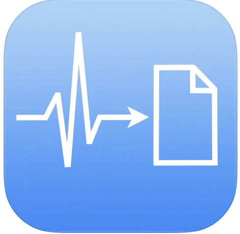
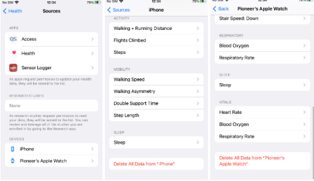
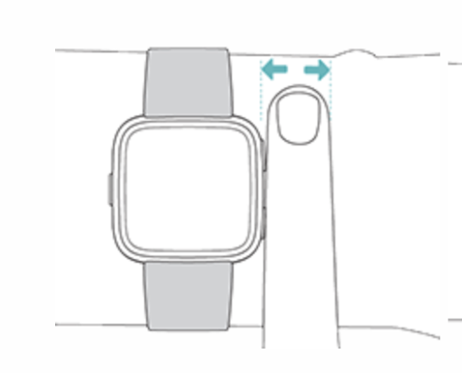
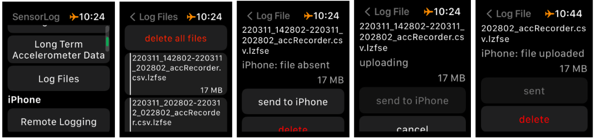
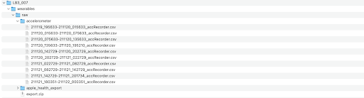

# Linking Brain States to Behavior and Biometrics (LB3) Study SOP

## Overview

This document describes the process to carry out the LB3 study with the Apple watches.

## Update Log

| Name        | Date        | Remarks     |
| ----------- | ----------- | ----------- |
| Jal Panchal      | 02/13/2022       | Wrote original document        |
| Jal Panchal      | 03/01/2022       | Updated instructions        |
| Akash Pattnaik      | 01/28/2023       | Cleaned, updated hotswaps, and converted to markdown        |

## Equipment

Each study pack consists of the following:

1. 2 Apple Watches (AW)
2. 2 AW USB-C charging cable
3. 1 Milanese loop strap
4. 1 Standard strap
5. 1 Study iPhone
6. 1 iPhone USB-C charging cable
7. 3 USB-C wall adapters
8. 10-15 Alcohol wipes for sanitation ([Covidien Welcol Alcohol Prep](https://www.amazon.com/Covidien-5110-Webcol-Alcohol-Sterile/dp/B00KJ74AEG?th=1))

Currently, we have two study packs:
1. Study pack 1 consists of AW1, AW2, and iPhone 1. 
2. Study pack 2 consists of AW3, AW4, and iPhone 2.

## Pre-trial

For each AW:

1. Charge to 100%

2. Ensure that SensorLog is installed

3. Open SensorLog

    

4. Delete old logs from SensorLog app

    a. Open the app and scroll down to `Log Files`

    b. Delete all existing log files

5. Charge iPhone to 100%

6. Delete old health data from the iPhone and AWs

    a. On the iPhone, open `Settings` &rarr; `Health` &rarr; `Data Access & Devices`

    

    b. Select `Delete All Data from 'iPhone'`

    c. In the `Watch` app, select AW[X]. Navigate back to settings and select `Delete All Data from AW[X]`

The pre-trial preparation is now complete and you are ready to consent a patient to the study.

## During trial

1. Once the subject is identified and consented, inquire which is the non-dominant hand of the subject. If the subject has an IV line on the hand, the watch can be worn on the other hand

### Trial start:

#### Script:
**LB3 Staff**: *Now we will put an Apple watch on your wrist.*


Ask which is their non-dominant wrist. If they are already wearing a watch, then request to move it to the other hand so the watch can be on the non-dominant wrist.

**LB3 Staff**: *We ask that you wear the watch throughout the day and avoid removing it. Please do not interact with the watch. If you do feel irritation, feel free to move the watch, and let one of the staff know when they come to charge the watch periodically.*

1. Sanitize the watch and strap with the alcohol wipes.

2. Open SensorLog and press `Start Logging`

3. Put the watch on the wrist of the selected hand of the subject.

    a. The back of the AW should be in contact with the skin.

    b. Ensure the band is not too tight.

    c. The watch should be able to move back and forth on the subject's wrist.

    d. The watch should be one finger width away from the wrist.

    

    e. Cover the watch face with your palm to lock the screen, it should go black.

    f. Note the following for entry in RedCap: 1. Start time once the subject has worn the watch, 2. Watch name, 3. Hand on which the watch is worn

### Hotswaps

The old AW should be swapped with a new AW every **48 hours**.

> **Note**: SensorLog saves the accelerometer data on the watch for 72 hours, after which it is overwritten. The watch must be swapped and SensorLog data must be transferred to the iPhone within every 72 hours. For example, say the watch was put on the subject at 12:00 on 2/1. On the daily check on 2/4, the data must be exported before 12:00. 

In the subject's room:

1. Approach the patient to swap the watches. 

2. Remove old AW and note the time for entry in RedCap.

3. For the new AW, repeat steps 1 through 3 from *Trial start*.

4. Note the time the new AW was put on for entry in RedCap.

In the research room:

1. Open SensorLog and press `Stop Logging`.

2. Press `Log Files` and ensure that the data has been logged.

3. On the iPhone, switch to the new AW in the `Watch` app. Then open the `Health` app and ensure the heart rate data syncs.

4. Open the LB3 project in RedCap and navigate to the Devices instrument for the subject.

5. In the section `Watch remarks/comments/notes:`, append the field with the hotswap times. For example:

    > /starthotswap
    > 
    > time: 00/00/2022 00:00
    > 
    > Tag: AW1
    > 
    > /endhotswap 
    >
    > /starthotswap
    > 
    > time: 00/00/2022 00:00
    > 
    > Tag: AW2
    > 
    > /endhotswap

## Post-trial

1. At the end of the trial, remove the watch and sanitize it. Note the end time and update the end time on RedCap.

    a. In the Participant information tab, update ​​Is this patient finished with this study (required to prevent extra tests) to Yes.

2. Charge both AWs and iPhone.

3. Make the following folder structure in Leif

    ```
    /mnt/leif/littlab/data/Human_Data/LB3_PIONEER   
    │
    └───LB3_XXX_phaseXX
        └───wearables
            │   wearables_metadata.csv
            │      
            └───raw
                └───Accelerometer
    ```

4. `wearables_metadata.csv` should be structured as follows:

    | property        | value                   |
    | --------------- | ----------------------- |
    | lb3_id          | LB3_XXX_phaseXX         |
    | watch_hand      | right OR left           |
    | study_start     | <mm/dd/yyyy hh:mm:ss>   |
    | study_end       | <mm/dd/yyyy hh:mm:ss>   |


5. Export Health activity data:

    a. Sync watch to apple health as in `Trial Maintenance`.

    b. In the `Health` app, navigate to the user profile, by tapping on the profile image on the top right.

    c. Scroll down the list and tap on `Export All Health Data`

    d. The `export.zip` file can be sent to a laptop using Airdrop or email

    e. Move `export.zip` to `/mnt/leif/littlab/data/Human_Data/LB3_PIONEER/LB3_XXX_phaseXX/wearables/raw`

    f. Unzip the file here to create the `apple_health_export` folder

6. Export Accelerometer data:

    a. On the watch, open the SensorLog and Navigate to LogFiles. Here you can see all the accelerometer files listed.

    b. Tap on a file, and tap on send to iPhone

    c. You will see the indication sent once the file is sent

    

    d. Repeat this process for all the files and send them to the iPhone

    > Note: The files transfer only when the screen is on and the app in active.

    e. On the iPhone, open the SensorLog App and navigate to the Files tab at the bottom.

    f. You should see all the accelerometer files sent from the watch. These files can be set to a laptop using Airdrop or email.

    g. The folder should look like this:

    

## Troubleshooting and FAQs


## Useful links and resources

* [iPhone credentials](https://mynotebook.labarchives.com/share/CNT%2520Notebook/NDk1LjN8NjkzNDY1LzM4MS04MDAvVHJlZU5vZGUvMjQ0ODcyNDk5MHwxMjU3LjM=)

## Contacts

| Name        | Phone Number        | Email     |
| ----------- | ----------- | ----------- |
| Akash Pattnaik      | 608-719-9767       | pattnaik@seas.upenn.edu        |
| Ashley Tranquille      |        | ashleytr@seas.upenn.edu        |
| William Ojemann      |        | wojemann@seas.upenn.edu        |
| Kevin Xie      |        | kevinxie@seas.upenn.edu        |